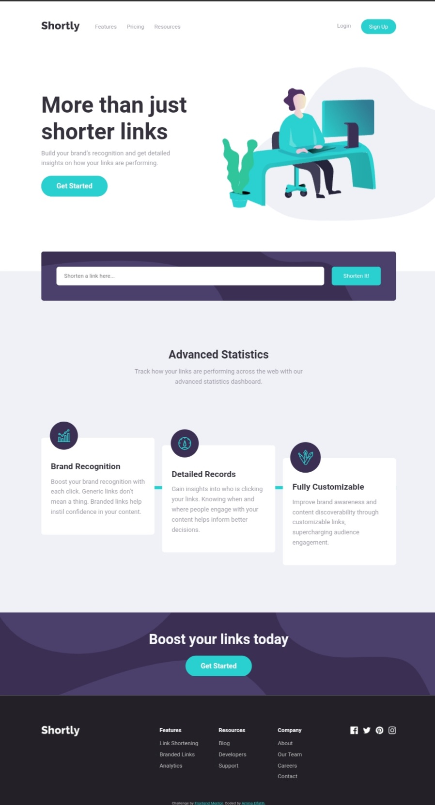

# Frontend Mentor - Shortly URL shortening API Challenge solution

This is a challenge to short any link 🔗  using https://short.io/ API.

## Table of contents

- [Overview](#overview)
  - [The challenge](#the-challenge)
  - [Screenshot](#screenshot)
  - [Links](#links)
- [My process](#my-process)
  - [Built with](#built-with)

## Overview

### The challenge

let's short your long link 🔗, This website to short any long link like youtube link, social media link, etc,.

### Screenshot

### Links

- Solution URL: [Repo link](https://your-solution-url.com)
- Live Site URL: [Live link](https://your-live-site-url.com)

## My process

### Built with

- Semantic HTML5 markup
- CSS custom properties
- Flexbox
- CSS Grid
- Bootstrap
- JavaScript
